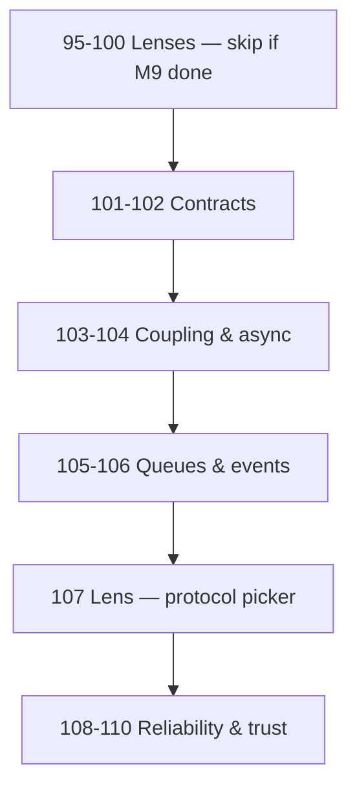

# Module 13: The Laws of Communication

*Chapter 4 — Foundations of Software Systems*

> **Topics 95–100 and 107 are ~3 min lenses on Module 9.** This module's unique value starts at **101** (contracts, coupling, events, trust). See [CONCEPT-INDEX](../CONCEPT-INDEX.md).

> **Modern architecture is largely the study of communication patterns. Before selecting technologies, identify the conversation that needs to happen.**

Module 10 taught **forces**. Module 11 taught **data**. Module 12 taught **scale**. Module 13 teaches **communication** — who talks to whom, about what, and when.

---

## Prerequisites

Complete **[Module 9: APIs For Product Builders](../module-09-apis-for-product-builders/)** for tactical protocol knowledge. This module elevates those tools into **architectural laws**.

| Module | Why it matters here |
|--------|---------------------|
| [Module 9: APIs](../module-09-apis-for-product-builders/) | REST, Webhooks, WebSockets, GraphQL, gRPC |
| [Module 1: Reliability](../module-01-reliability/) | Retry, idempotency, circuit breaker |
| [Module 5: Distributed](../module-05-distributed-systems/) | Queues, pub/sub, events |
| [Module 10: Law 11](../module-10-laws-of-software-systems/69-communication-determines-architecture.md) | Communication determines architecture |
| [Module 12: Law 32](../module-12-laws-of-scale/91-queues-absorb-chaos.md) | Queues from scale lens |

---

## Topics

| # | Law | One-line principle | Read time |
|---|-----|-------------------|-----------|
| 95 | [Every System Is a Conversation](./95-every-system-is-a-conversation.md) | Architecture is designed conversations | ~3 min *(lens)* |
| 96 | [Communication Defines Architecture](./96-communication-defines-architecture.md) | Conversation first, technology second | ~3 min *(lens)* |
| 97 | [Request-Response Is the Default](./97-request-response-is-the-default.md) | Ask, answer, done — unless you have reason not to | ~3 min *(lens)* |
| 98 | [Simplest Conversation Wins](./98-simplest-conversation-wins.md) | Hotel details don't need WebSockets | ~3 min *(lens)* |
| 99 | [Real-Time Has a Cost](./99-real-time-has-a-cost.md) | Persistent connections trade simplicity | ~3 min *(lens)* |
| 100 | [Notifications Reverse the Direction](./100-notifications-reverse-direction.md) | Webhooks notify; polling asks | ~3 min *(lens)* |
| 101 | [Machines Prefer Structured Conversations](./101-machines-prefer-structured-conversations.md) | Explicit schemas reduce integration risk | ~12 min |
| 102 | [Contracts Outlive Implementations](./102-contracts-outlive-implementations.md) | Protect APIs — backends change, clients depend | ~12 min |
| 103 | [Communication Creates Coupling](./103-communication-creates-coupling.md) | More talk paths = more dependency | ~12 min |
| 104 | [Asynchronous Communication Buys Flexibility](./104-asynchronous-communication-buys-flexibility.md) | Time becomes a resource | ~12 min |
| 105 | [Queues Absorb Uncertainty](./105-queues-absorb-uncertainty.md) | Spikes become manageable flow | ~3 min *(lens)* |
| 106 | [Events Describe Facts](./106-events-describe-facts.md) | Something happened — many can react | ~12 min |
| 107 | [Different Conversations Need Different Languages](./107-different-conversations-need-different-languages.md) | No universal protocol | ~3 min *(lens)* |
| 108 | [Reliability Over Speed](./108-reliability-over-speed.md) | Undelivered fast message has no value | ~12 min |
| 109 | [Communication Failures Are Normal](./109-communication-failures-are-normal.md) | Design for failure, not perfection | ~12 min |
| 110 | [Communication Is a Trust Problem](./110-communication-is-a-trust-problem.md) | Auth, encryption, signatures exist because of talk | ~12 min |

---

## The Communication Lens

| Lens | Focuses on |
|------|------------|
| **Junior engineer** | Endpoints, HTTP methods, status codes |
| **Senior engineer** | Conversation patterns, contracts, failure modes |
| **Architect** | **Who needs to talk to whom, about what, and when?** |

Technology is merely the language chosen for the conversation.

---

## Learning Order



**Core unique value:** topics **101–110**. Topics 95–100 are ~3 min lenses on Module 9.

---

## Cross-Module Map

| Law | Connects to Module |
|-----|-------------------|
| Every System Is a Conversation | Module 10: Law 11 |
| Communication Defines Architecture | Module 9: Conversation Patterns |
| Request-Response Default | Module 9: REST |
| Simplest Conversation Wins | Module 9: Stack Evolution |
| Real-Time Has a Cost | Module 9: WebSockets |
| Notifications Reverse Direction | Module 9: Webhooks |
| Contracts Outlive Implementations | Module 9: All APIs |
| Communication Creates Coupling | Module 12: Law 27 |
| Async Communication | Module 5: Message Queue |
| Queues Absorb Uncertainty | Module 12: Law 32 |
| Events Describe Facts | Module 5: Event-Driven, Pub/Sub |
| Different Languages | Module 9: Full stack |
| Reliability Over Speed | Module 1: Retry, Idempotency |
| Failures Are Normal | Module 1: Circuit Breaker |
| Trust Problem | Module 6: SSL/TLS |

---

## Module Simulation

Design communication for a travel platform checkout:

1. **Law 36:** List every conversation in one booking flow.
2. **Law 37:** Which conversations exist before picking Kafka?
3. **Law 38–39:** Can hotel details use simple HTTP GET?
4. **Law 40:** Does booking confirmation need WebSockets?
5. **Law 41:** How does Razorpay tell you payment succeeded?
6. **Law 42–43:** What's the contract for `GET /bookings/{id}`?
7. **Law 44:** What breaks if Inventory Service is down?
8. **Law 45–46:** Email, invoice — sync or queue?
9. **Law 47:** `BookingCreated` vs `CreateBooking` — difference?
10. **Law 48:** REST vs gRPC for internal pricing service?
11. **Law 49–50:** Payment webhook times out — what happens?
12. **Law 51:** How do you verify the webhook is really from Razorpay?

---

## Architect's Reflection

Junior engineers focus on endpoints. Senior engineers focus on communication patterns. Architects focus on **information flow**.

Every architecture diagram answers one question:

> Who needs to talk to whom, about what, and when?

---

## PDFs

```bash
python3 md_to_pdf.py --dir learning/module-13-laws-of-communication --force
```

## Previous Module

**[Module 12: The Laws of Scale](../module-12-laws-of-scale/)** — Bottlenecks, distribution, peaks, predictability.

## Next Module

**[Module 14: The Laws of Frontend Systems](../module-14-laws-of-frontend-systems/)** — The browser as distributed runtime.
