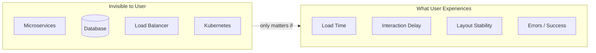

# 111. Law 52: The User Experiences the Frontend, Not the Architecture

> **Think:** *"Would a user notice our microservices refactor?"*

---

## The 4 Questions

| Question | Answer |
|----------|--------|
| **What problem does it solve?** | Engineering vanity — perfect backend architecture that still feels slow, janky, or unreliable to users. |
| **What happens if I ignore it?** | Team celebrates Kafka migration while users complain the app "feels broken." NPS drops despite clean system diagrams. |
| **Where would I use it?** | Prioritization, perf budgets, UX reviews, deciding what to optimize first, founder-facing metrics. |
| **What companies use it?** | Apple (perceived performance), Amazon (1-click feel), every product where UX metrics drive revenue. |

---

## Mental Movie (60 seconds)

Users never see:
- Your 12 microservices
- PostgreSQL read replicas
- Kubernetes pods
- Redis cluster

Users experience:
- **Loading speed** — did the page appear in 1s or 4s?
- **Responsiveness** — did the button react instantly?
- **Visual stability** — did content jump around (CLS)?
- **Reliability** — did checkout work or show a spinner forever?

**Perception often matters more than implementation.**

A mediocre architecture that **feels fast** beats a beautiful architecture that **feels slow**.

---

## How It Works

### User-Facing Metrics (Core Web Vitals)

| Metric | Measures | Target |
|--------|----------|--------|
| **LCP** | Largest content paint | < 2.5s |
| **INP** | Interaction responsiveness | < 200ms |
| **CLS** | Layout shift | < 0.1 |

Backend p99 can be 50ms — user still waits 3s if frontend ships 2MB JS and 50 uncached images.

---

## Real-World Examples

### Your Travel Platform

**Invisible win:** Migrated booking service to Go. Users notice: nothing (if UX unchanged).

**Visible win:** Search results appear with skeleton in 200ms, images lazy-load, pagination 20 hotels. Users notice: "App feels fast."

**Visible failure:** Microservices add 400ms latency chain. Users notice: "Booking is slow" — don't care why.

### Nykaa

Flash sale UX: skeleton grids, optimistic cart, progress indicators. **Perceived** readiness during backend queue. Conversion protected.

### Amazon

1-Click feels instant — years of UX investment on **perception**, not just backend speed.

---

## When Perception Drives Decisions

| Prioritize UX when... | |
|-----------------------|---|
| **Conversion** tied to speed | Checkout, search |
| **Mobile** users on 4G | India market |
| **Competitive** category | Travel, ecommerce |
| **Backend** already optimized | Frontend is bottleneck |

---

## Connection To Other Laws & Modules

| Connection | Link |
|------------|------|
| Law 124 | Perception metrics |
| Law 125 | Distributed failures hit UX |
| Module 3: Performance | Tactical frontend speed |

---

## Problem Simulation

Team ships microservices rewrite. Backend latency improved 30%. User complaints up 20% — "app feels slower."

Investigation: frontend now makes 8 sequential API calls instead of 1 monolith response.

**Questions:**
1. Which law explains user complaints?
2. What metric improved vs what users feel?
3. Fix priority?
4. Law 116 connection?

Answers

1. **Law 52** — users experience frontend flow, not backend latency.
2. **Backend p50 improved**; **user-visible round trips increased** (8× network).
3. **BFF/aggregate API** or parallel fetch — reduce client-visible communication (Law 116).
4. **Network slower than code** — 8 sequential calls dominate.

---

## Key Takeaway

Users judge the frontend — load time, responsiveness, stability. Optimize what they experience, not what architects diagram.

**Next:** [112 — Rendering Is Work](./112-rendering-is-work.md)
