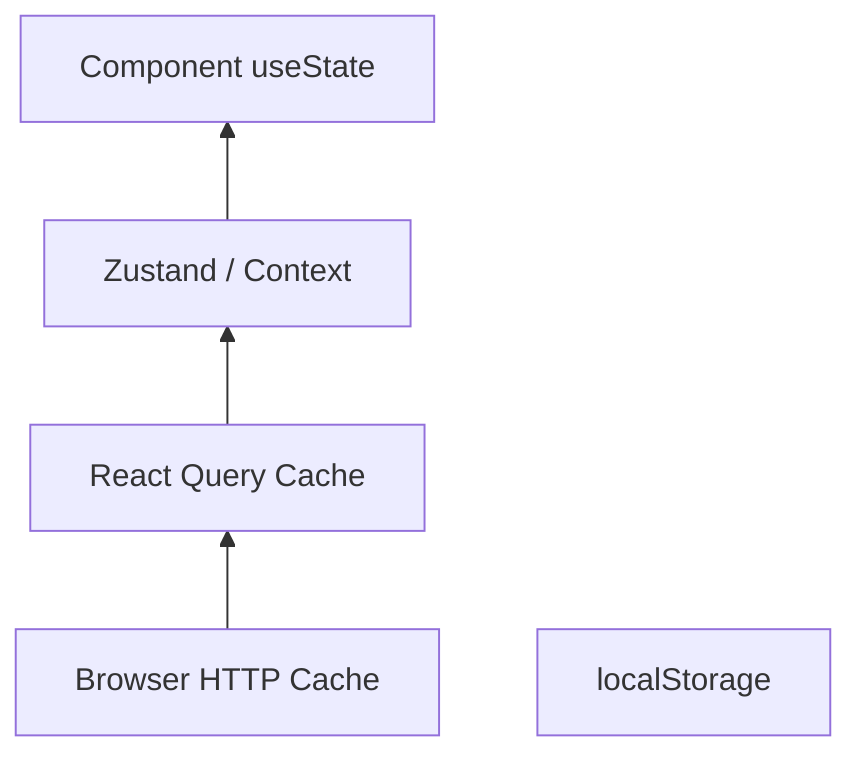

# 113. Law 54: State Is Memory

> **Think:** *"Where is this information remembered — and for how long?"*

---

## The 4 Questions

| Question | Answer |
|----------|--------|
| **What problem does it solve?** | State chaos — data duplicated across Context, Redux, React Query, localStorage with no memory model. |
| **What happens if I ignore it?** | Stale UI, memory leaks, "refresh fixes it," impossible-to-debug sync bugs. |
| **Where would I use it?** | State architecture, choosing React Query vs Zustand vs Context, cache TTL design. |
| **What companies use it?** | Every mature React shop — explicit state layers and cache policies. |

---

## Mental Movie (60 seconds)

Backend memory layers:
```
PostgreSQL → durable
Redis      → hot cache
CDN        → edge memory
```

Frontend memory layers:
```
useState/useReducer  → component memory
Context/Zustand      → app memory
React Query/SWR      → server response memory
localStorage         → persistent browser memory
Service Worker       → offline cache
Browser HTTP cache   → network memory
```

**State is simply remembered information.**

**State management is memory management** — same laws as Module 10 and 11, different runtime.

---

## How It Works



### State Layer Guide

| Layer | Remember | TTL |
|-------|----------|-----|
| `useState` | UI ephemeral | Until unmount |
| Context/Store | Cross-component UI | Session |
| React Query | Server responses | staleTime config |
| localStorage | Preferences, tokens | Persistent |
| Service Worker | Assets, offline | Until evicted |

---

## Real-World Examples

### Your Travel Platform

| Data | Memory layer |
|------|--------------|
| Modal open/closed | `useState` |
| Selected currency | Zustand + localStorage |
| Hotel search results | React Query (5 min stale) |
| Auth token | httpOnly cookie (not JS state) |
| User profile | React Query + background refetch |

### Nykaa

Cart in persistent store. Catalog in query cache. Theme in localStorage. Clear ownership per layer.

### Amazon

Client state minimized. Server state aggressively cached. Session in cookies.

---

## When To Add State Layers

| Add layer when... | |
|-------------------|---|
| **Prop drilling** painful | Context/Zustand |
| **Server data** refetched too often | React Query |
| **Survive refresh** needed | localStorage (non-sensitive) |
| **Offline** required | Service Worker |

## Anti-Pattern

Copying server response into `useState` on fetch — **two memories** for same data, sync bugs guaranteed (Law 114).

---

## Connection To Other Laws & Modules

| Connection | Link |
|------------|------|
| Law 114 | Server vs client state |
| Law 115 | Cache = memory |
| Module 10: Law 4, 10 | Memory beats recalculation |
| Module 11: Law 22 | Software as memory system |

---

## Problem Simulation

Hotel list fetched in parent `useState`, copied to child, edited in filter component — parent stale after filter.

**Questions:**
1. Which law violated?
2. Fix?
3. Law 114 connection?

<details>
<summary>Answers</summary>

1. **Law 54/114** — server data in client state without sync model.
2. **React Query** as single source for server list; filter derives from cache client-side.
3. **Server state ≠ client state** — don't duplicate without strategy.

</details>

---

## Key Takeaway

Frontend state is memory at multiple layers. Choose where each piece of information lives — and how long it's remembered.

**Next:** [114 — Server State ≠ Client State](./114-server-state-vs-client-state.md)
