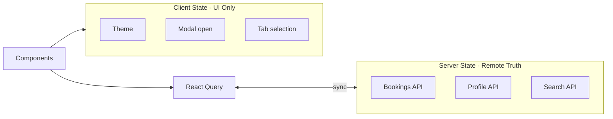

# 114. Law 55: Server State and Client State Are Different

> **Think:** *"Does this data live on the server — or only in the UI?"*

---

## The 4 Questions

| Question | Answer |
|----------|--------|
| **What problem does it solve?** | Treating API responses like local `useState` — manual fetch, setState, no cache, no staleness, no background sync. |
| **What happens if I ignore it?** | Duplicate fetches, stale bookings after payment, loading spinners on every navigation, `useEffect` spaghetti. |
| **Where would I use it?** | React Query/TanStack Query adoption, state architecture, separating UI state from remote data. |
| **What companies use it?** | Modern React apps — React Query/SWR as standard for server state. |

---

## Mental Movie (60 seconds)

**Client state** — exists only in browser, no server source of truth:
```
Theme: dark mode
Sidebar: open
Active tab: "upcoming"
Modal: visible
Form draft: unsaved input
```

**Server state** — truth lives on server, client holds a copy:
```
User profile
Booking list
Hotel catalog
Payment status
```

Server state **must be synchronized** — can be stale, needs refetch, shared across tabs, invalidated on mutation.

**Do not treat server state like local state.**

---

## How It Works



| | Client State | Server State |
|---|--------------|--------------|
| **Source of truth** | Browser | Server |
| **Tool** | useState, Zustand | React Query, SWR |
| **Stale?** | Only if bug | By design (TTL) |
| **Shared across users** | No | Yes |
| **Invalidate on** | User action | Mutation, webhook, TTL |

---

## Real-World Examples

### Your Travel Platform

| State | Type | Tool |
|-------|------|------|
| Dark mode | Client | Zustand |
| Search filters (pre-submit) | Client | useState |
| Search results | Server | React Query |
| User bookings | Server | React Query |
| "Booking just created" optimistic | Server + client overlay | React Query mutation |

**On booking success:** `queryClient.invalidateQueries(['bookings'])` — not manual `setBookings([...])`.

### Nykaa

Cart UI state local. Product prices server — refetch on sale events. Never hardcode price in client state alone.

### Amazon

Server state cached aggressively. Client state for UI chrome only.

---

## When To Use Which

| Client state tool when... | Server state tool when... |
|---------------------------|---------------------------|
| UI toggles, forms in progress | API-fetched data |
| No server counterpart | Needs cache, dedup, background refresh |
| Dies with session | Shared across components/routes |

---

## Connection To Other Laws & Modules

| Connection | Link |
|------------|------|
| Law 113 | State as memory |
| Law 115 | React Query cache |
| Module 11: Law 14 | Server owns truth |

---

## Problem Simulation

`useEffect` fetches bookings on every page visit. User navigates away and back — full loading spinner each time. After new booking, list stale until hard refresh.

**Questions:**
1. Client vs server state mistake?
2. Fix with React Query?
3. After `POST /bookings`?

<details>
<summary>Answers</summary>

1. **Server state managed as ephemeral client state** — no cache, no invalidation.
2. **`useQuery(['bookings'])`** with staleTime 30s — instant back-navigation from cache.
3. **`invalidateQueries(['bookings'])`** or optimistic update on mutation success.

</details>

---

## Key Takeaway

Client state is UI-only. Server state is synchronized remote truth — use dedicated tools (React Query), not raw `useState` + `useEffect`.

**Next:** [115 — The Fastest Request Is Never Made](./115-fastest-request-is-never-made.md)
