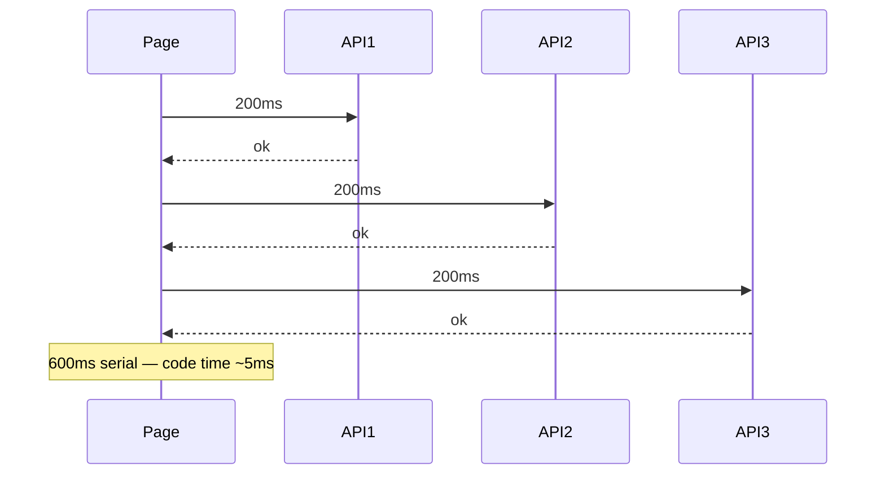

# 116. Law 57: Network Is Usually Slower Than Code

> **Think:** *"Is this slow because of JavaScript — or because of API calls?"*

---

## The 4 Questions

| Question | Answer |
|----------|--------|
| **What problem does it solve?** | Profiling React components when the bottleneck is 6 sequential API calls on 4G. |
| **What happens if I ignore it?** | Weeks optimizing `useMemo` while page waits 2s on network waterfall. |
| **Where would I use it?** | Waterfall elimination, parallel fetching, BFF, GraphQL, bundle vs network tradeoffs. |
| **What companies use it?** | Every mobile-first product — network dominates on real devices. |

---

## Mental Movie (60 seconds)

```
JavaScript function:     microseconds – milliseconds
API round trip (4G):     200ms – 2000ms
API round trip (3G):     500ms – 5000ms
```

**Frontend performance is often limited by communication, not computation.**

Six sequential API calls on mobile = 1.2s minimum even if each React component is perfect.

> **Module 13: Law 28** — networks not instant. **Module 10: Law 7** — latency additive. This is the **frontend experience** of those laws.

---

## How It Works



### Fixes

| Pattern | Savings |
|---------|---------|
| **Parallel fetch** | `Promise.all` |
| **BFF aggregate** | 1 call not 6 |
| **GraphQL** | One round trip |
| **Prefetch** | Overlap with navigation |
| **Cache** | Law 115 — zero network |

---

## Real-World Examples

### Your Travel Platform

Checkout page serial: profile → wallet → bookings → payment-methods = 800ms network.

**Fix:** `GET /checkout/context` BFF returns all — 200ms once.

### Nykaa

Mobile screens use aggregated APIs. Internal parallel fetch at gateway.

### Amazon

Page-critical data in one payload. Secondary data lazy.

---

## Key Takeaway

Profile network waterfalls before React micro-optimizations. Parallelize, aggregate, cache — code is rarely the bottleneck.

**Next:** [117 — Loading Everything Is Rarely Correct](./117-loading-everything-is-rarely-correct.md)
