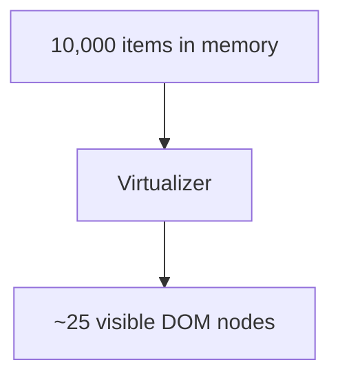

# 119. Law 60: Virtualization Controls Rendering

> **Think:** *"User sees 20 rows — why are 10,000 in the DOM?"*

---

## The 4 Questions

| Question | Answer |
|----------|--------|
| **What problem does it solve?** | Rendering entire lists — 10K table rows, long chat history, infinite admin tables — DOM explosion. |
| **What happens if I ignore it?** | Scroll jank, memory pressure, 3s mount time, mobile crash. |
| **Where would I use it?** | Long lists, data grids, chat logs, autocomplete with many options. |
| **What companies use it?** | Twitter feed, Gmail, Excel-like grids — react-window, tanstack-virtual. |

---

## Mental Movie (60 seconds)

User scrolls admin table: **10,000 booking rows** in data.

Screen shows **~20 visible rows**.

**Without virtualization:** 10,000 DOM nodes — layout hell.

**With virtualization:** ~25 DOM nodes (buffer) — scroll recycles rows.

**Render what is visible. Not what exists.**

---

## How It Works

Tools: `react-window`, `@tanstack/react-virtual`, AG Grid virtualization.

**Note:** Virtualization controls **render** cost. Still paginate **network** (Law 118) for initial fetch.

---

## Real-World Examples

### Your Travel Platform

Admin bookings table: 50K rows — virtualized grid, server-side pagination + filter.

### Nykaa

Long order lists on seller dashboard — virtualized.

### Amazon

Seller central tables — virtual scroll.

---

## Key Takeaway

Keep full dataset in memory if needed — but only mount visible rows in DOM. Virtualize long lists.

**Next:** [120 — Re-Renders Are Repeated Work](./120-re-renders-are-repeated-work.md)
