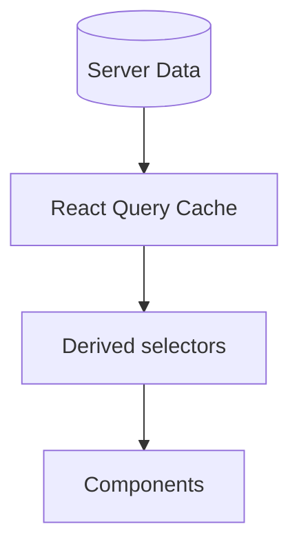

# 126. Law 67: Every UI Is a Projection of Data

> **Think:** *"If the data changes, what should the screen show?"*

---

## The 4 Questions

| Question | Answer |
|----------|--------|
| **What problem does it solve?** | UI-driven logic — components as primary truth with data bolted on, duplicate display state. |
| **What happens if I ignore it?** | `hotelName` in state AND in props — out of sync. Edit data, UI doesn't update. |
| **Where would I use it?** | Unidirectional data flow, React Query as source, derived state, presentation components. |
| **What companies use it?** | React core model — UI = f(state). Redux/React Query architectures. |

---

## Mental Movie (60 seconds)

```
Hotel Card (UI) = projection of Hotel {id, name, price, rating, image}
```

Buttons, badges, cards are **not** primary reality. **Data is.**

UI renders **views** over data. Change data → UI updates. Don't duplicate data into UI-shaped state.

**Principle from backend:** Database is truth, API projects it. **Frontend:** Server data is truth, components project it.

---

## How It Works



| Pattern | Example |
|---------|---------|
| **Presentational component** | `HotelCard({ hotel })` — pure projection |
| **Derived state** | `const total = nights * price` — compute, don't store |
| **Single source** | One cache entry per entity |

---

## Real-World Examples

### Your Travel Platform

`HotelCard` receives `hotel` object — no internal copy of name/price. Price update in cache → all cards update.

### Nykaa

Product card dumb component. Data from normalized store/query.

---

## Key Takeaway

UI is a projection layer — data is truth. Render from source; derive don't duplicate; update data and UI follows.

**Next:** [127 — Complexity Flows Toward the Client](./127-complexity-flows-toward-the-client.md)
