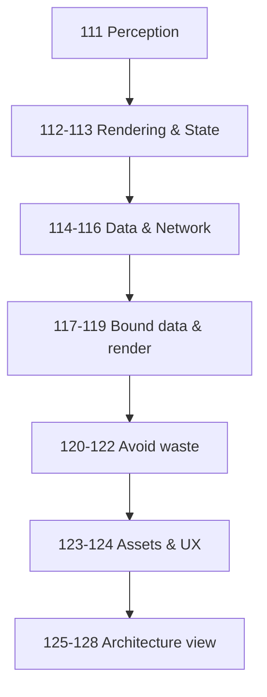

# Module 14: The Laws of Frontend Systems

*Chapter 5 — Foundations of Software Systems*

> **Topics 115, 118, 122, 128 are lenses on Modules 3 and 10.** Unique browser topics: **111–114, 116–117, 119–121, 123–127**. See [CONCEPT-INDEX](../CONCEPT-INDEX.md).

> **The browser is not merely a display tool. It is a distributed runtime executing part of the application.**

Module 10 taught **forces**. Module 11 **data**. Module 12 **scale**. Module 13 **communication**. Module 14 teaches what happens when part of the system runs in the user's browser — rendering, state, memory, and perception.

---

## Prerequisites

| Module | Why it matters here |
|--------|---------------------|
| [Module 3: Performance](../module-03-performance/) | Caching, pagination, lazy loading, compression, CDN |
| [Module 10: Laws of Systems](../module-10-laws-of-software-systems/) | Memory, repetition, fastest request never made |
| [Module 13: Communication](../module-13-laws-of-communication/) | API calls from browser are network conversations |

---

## Topics

| # | Law | One-line principle | Read time |
|---|-----|-------------------|-----------|
| 111 | [The User Experiences the Frontend](./111-user-experiences-the-frontend.md) | Perception beats architecture diagrams | ~12 min |
| 112 | [Rendering Is Work](./112-rendering-is-work.md) | Every pixel costs CPU and memory | ~12 min |
| 113 | [State Is Memory](./113-state-is-memory.md) | React state is remembered information | ~12 min |
| 114 | [Server State ≠ Client State](./114-server-state-vs-client-state.md) | Don't treat remote data like local UI state | ~12 min |
| 115 | [The Fastest Request Is Never Made](./115-fastest-request-is-never-made.md) | Cache beats optimize | ~3 min *(lens)* |
| 116 | [Network Is Slower Than Code](./116-network-is-slower-than-code.md) | Frontend perf is usually I/O-bound | ~12 min |
| 117 | [Loading Everything Is Rarely Correct](./117-loading-everything-is-rarely-correct.md) | Transfer only what the screen needs | ~12 min |
| 118 | [Pagination Controls Growth](./118-pagination-controls-growth.md) | Bounded payloads scale | ~3 min *(lens)* |
| 119 | [Virtualization Controls Rendering](./119-virtualization-controls-rendering.md) | Render visible rows, not all rows | ~12 min |
| 120 | [Re-Renders Are Repeated Work](./120-re-renders-are-repeated-work.md) | Same output, wasted layout/paint | ~12 min |
| 121 | [Code Has Weight](./121-code-has-weight.md) | Every KB of JS slows startup | ~12 min |
| 122 | [Load Work Only When Needed](./122-load-work-only-when-needed.md) | Lazy routes and dynamic imports | ~3 min *(lens)* |
| 123 | [Images Dominate Assets](./123-images-dominate-assets.md) | Optimize bytes before algorithms | ~12 min |
| 124 | [Perception Is a Performance Metric](./124-perception-is-a-performance-metric.md) | Skeleton beats blank screen | ~12 min |
| 125 | [Frontend Is a Distributed System](./125-frontend-is-a-distributed-system.md) | Browser + CDN + API + auth + payments | ~12 min |
| 126 | [UI Is a Projection of Data](./126-ui-is-a-projection-of-data.md) | Cards display data; data is truth | ~12 min |
| 127 | [Complexity Flows Toward the Client](./127-complexity-flows-toward-the-client.md) | SPAs behave like applications | ~12 min |
| 128 | [Frontend Optimization Is Universal](./128-frontend-optimization-is-universal.md) | Same laws, different manifestations | ~5 min *(capstone)* |

---

## The Frontend Lens

| Lens | Focuses on |
|------|------------|
| **Component developer** | JSX, hooks, CSS |
| **Frontend engineer** | State, data fetching, bundle size |
| **Architect** | **What should the user see? What data is required? What's the cheapest path?** |

---

## Learning Order



---

## Cross-Module Map

| Law | Connects to Module |
|-----|-------------------|
| Fastest Request Never Made | Module 10: Law 8; Module 3: Caching |
| Network Slower Than Code | Module 13: Law 28; Module 10: Law 7 |
| Pagination | Module 3: Pagination |
| Load Work When Needed | Module 3: Lazy Loading |
| Images Dominate | Module 3: CDN, Compression |
| Frontend Is Distributed | Module 13: Law 36 |
| Universal Optimization | Module 10: Unifying Principle |

---

## Module Simulation

Hotel search page: 4.2s load, 2MB JSON, 200 hotel cards, images from US CDN, refetch on every navigation.

Trace laws 52–69. Fix each. Estimate combined improvement.

---

## Architect's Reflection

Junior developers focus on components. Experienced engineers focus on state. Architects focus on **flows**.

Every frontend answers three questions:
1. What should the user see?
2. What data is required?
3. What is the cheapest path to deliver it?

---

## PDFs

```bash
python3 md_to_pdf.py --dir learning/module-14-laws-of-frontend-systems --force
```

## Previous Module

**[Module 13: The Laws of Communication](../module-13-laws-of-communication/)**
